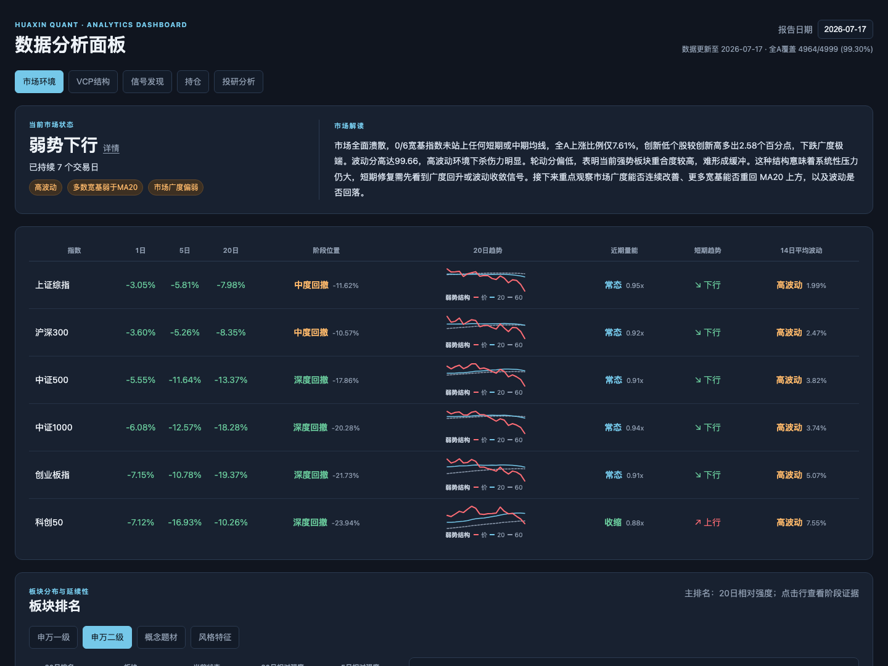

# Huaxin Quant

[中文](README.md) | English

A research-oriented multi-model discovery and tracking system for China A-shares. It combines fundamental screening, VCP price-volume structure, cross-day signal tracking, and next-session plans into a reproducible workflow. Scripts and strategy files make the core decisions; LLMs only enrich market and signal commentary.

> For research and review only. Not investment advice.



## Run the full workflow

```bash
python3 -m pip install -r requirements.txt
cp .env.example .env
python3 scripts/init_runtime.py

# Expected latest trading day, using a 15:00 cutoff
python3 scripts/daily.py &

# Rebuild one trading date end to end
python3 scripts/daily.py --date 260709 &
python3 scripts/monitor.py --date 260709
```

`daily.py` runs one date through data preparation, Pool, Quant, Bloom, Signal Plan, and the Market / VCP / Signals dashboard packages. It finishes only after verifying that all three dashboard modules published that date.

## Modules

| Layer | Module | Purpose |
|---|---|---|
| Screening | Pool | Fundamental candidate pool |
| Structure | Quant | VCP stages, risk facts, and PULLBACK / BREAKOUT / RETEST setups |
| Signals | Bloom + Signal Plan | Cross-day lifecycle and next-session price-volume plans |
| Market | Market Regime | Index trend, breadth, sector ranking, and strong stocks |
| Support | Valuation / Position | Deep valuation and a local position ledger |

## Useful commands

```bash
python3 scripts/quant_filter.py --date 260709
python3 scripts/bloom.py --date 260709
python3 scripts/signal_plan.py --date 260709
python3 scripts/market_regime.py run --date 2026-07-09
```

Open `dashboard/index.html` after a run to explore Market, VCP, and Signals by date.

## Repository layout

```text
instructions/  Model rules and execution constraints
strategies/    Adjustable strategy parameters
scripts/       Pipeline, data, and computation scripts
dashboard/     Read-only analytics dashboard
WORKFLOW.md    Standard daily and historical rebuild workflow
```

Runtime outputs such as `cache/`, `pool/`, `quant/`, `bloom/`, `signal_plan/`, and `market/` remain local and are not committed.

Read more: [Pool](instructions/01-pool.md) · [Quant](instructions/02-quant.md) · [Bloom](instructions/signal-bloom.md) · [Signal Plan](instructions/signal-plan.md) · [Market Regime](instructions/market-regime.md) · [Workflow](WORKFLOW.md).
