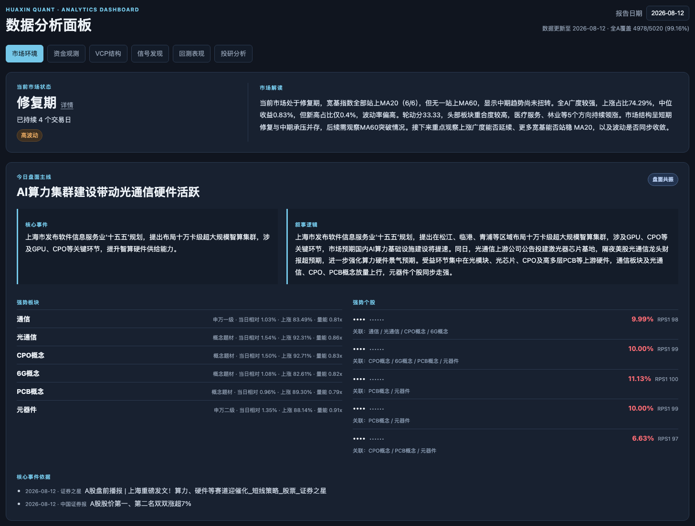
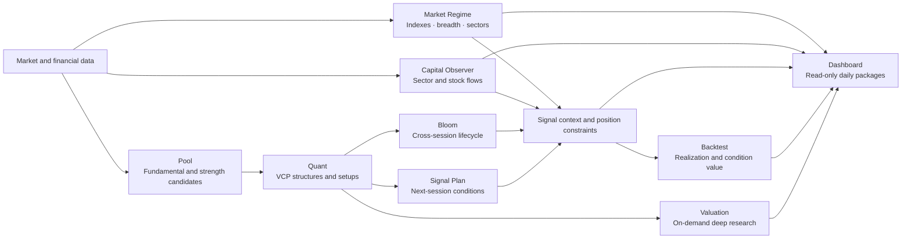
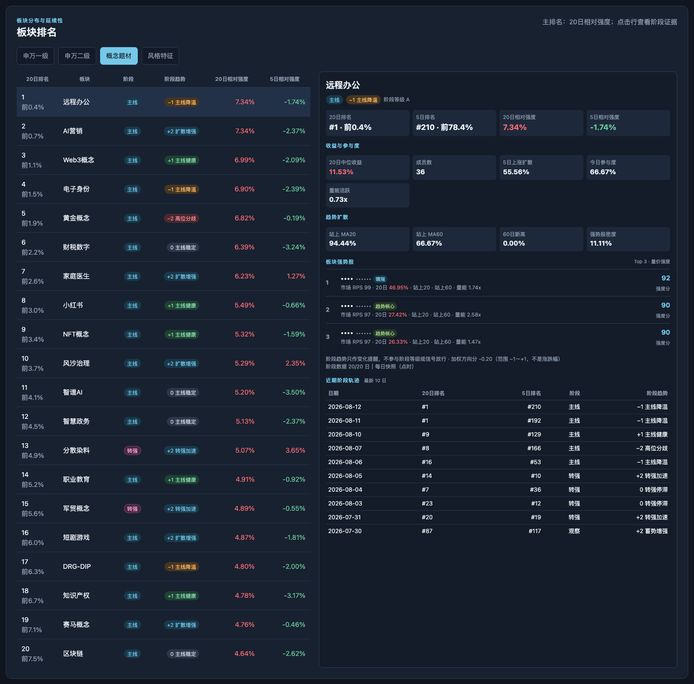
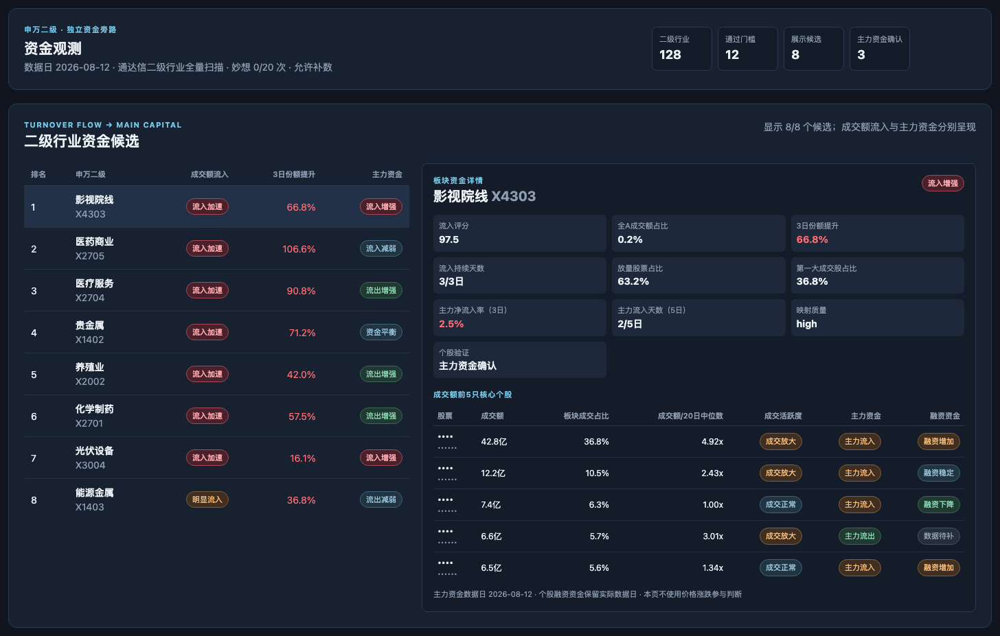
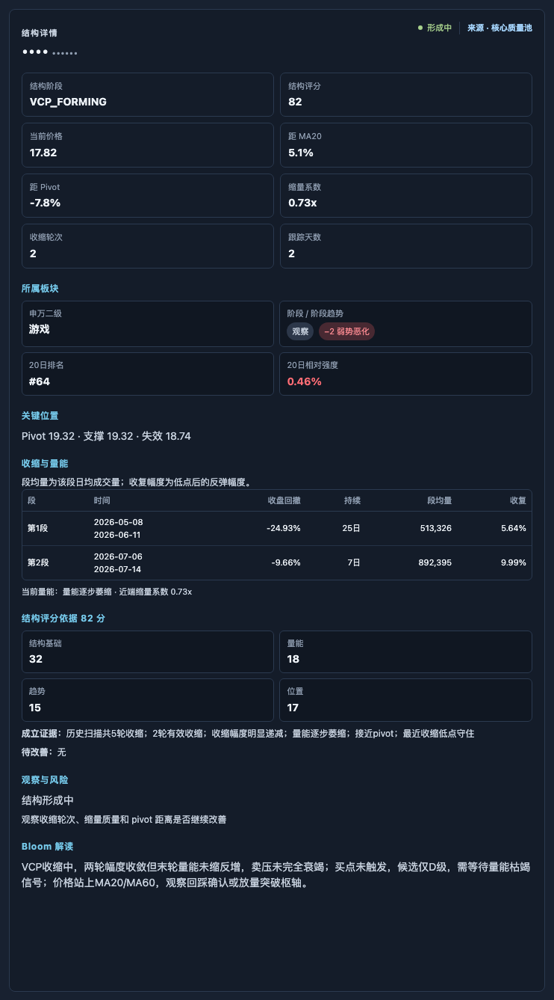
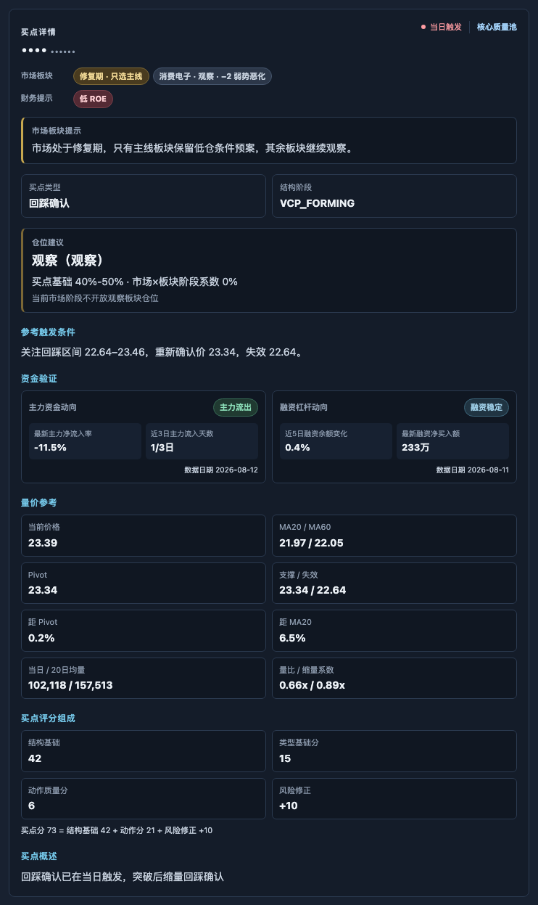
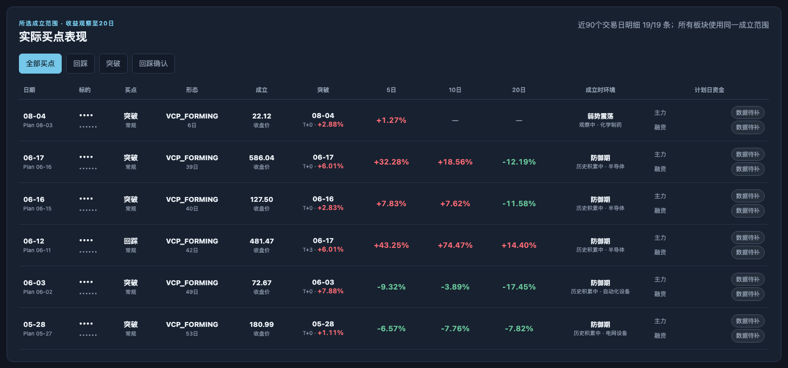
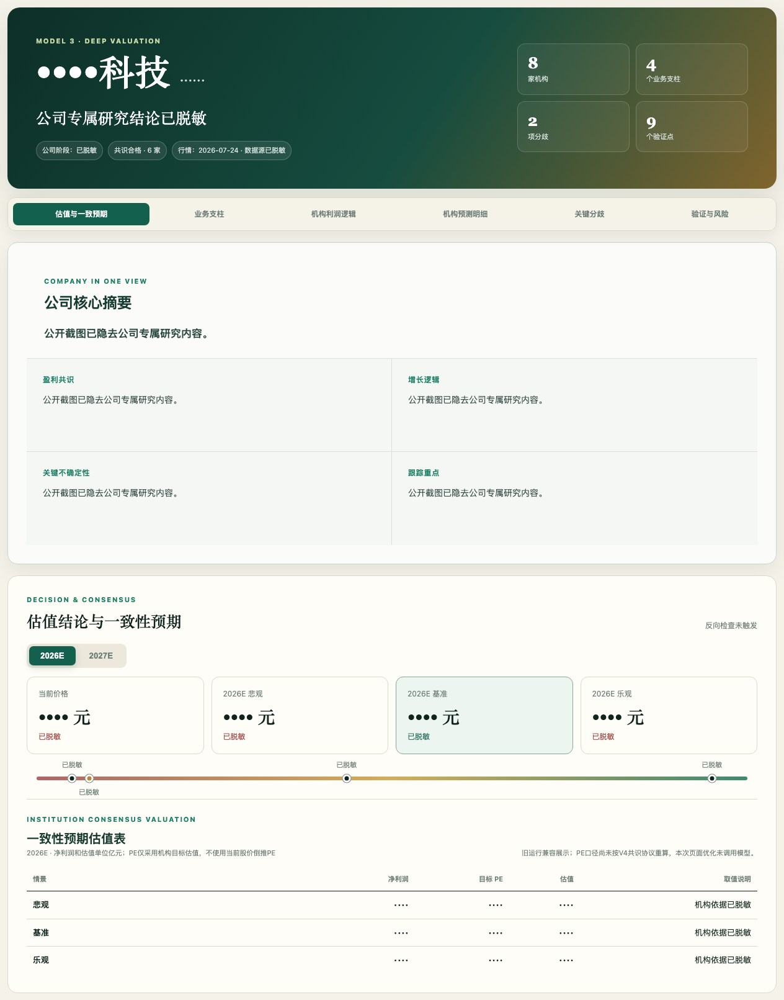

# Huaxin Quant

[中文](README.md) | English

[](https://github.com/neilnee/huaxin-quant/tags)
[](https://www.python.org/)
[](LICENSE)

**An auditable research and review workflow for China A-shares.** Huaxin Quant combines fundamental screening, VCP price-volume structures, cross-session signal lifecycles, and independent market and capital-flow validation into reproducible, date-scoped research runs.

Scripts and versioned strategy files determine structures, setups, scores, and position constraints. LLMs are limited to grounded market, signal, and valuation commentary; they do not rewrite deterministic conclusions.

> This project is for research, engineering experiments, and historical review only. It is not investment advice, and no signal, plan, valuation, or position hint implies a return guarantee.



## Why Huaxin Quant

| Principle | Implementation |
|---|---|
| Deterministic decisions | Pool, VCP, setup, risk, phase, and position rules run in Python with strategy JSON files |
| Cross-session lifecycle | Bloom tracks formation, maturity, trigger, cooldown, invalidation, and exit |
| Independent context | Market regime, Shenwan sectors, main-order flow, margin financing, and fundamentals remain separate |
| Auditable output | Inputs, strategy versions, actual data dates, failure reasons, and daily dashboard packages are retained |
| Explicit failure | Critical failures, invalid LLM publication state, or incomplete daily artifacts cannot silently finish as successful |

## Architecture



Each module stays within its own decision boundary. Market regime does not rewrite VCP results, capital flow does not change setup scores, LLMs do not replace structure rules, and valuation does not automatically become a trading action.

## Current capabilities

| Layer | Module | Main output |
|---|---|---|
| Data | Market Data / Capital Data | Daily bars, security universe, sector snapshots, main-order and financing caches |
| Screening | Pool | Fundamental quality pool, market-strength expansion pool, and soft tags |
| Structure | Quant | VCP phases, contractions, volume facts, risk flags, and three setup families |
| Signals | Bloom | Observation lifecycle, upgrades, triggers, cooldown, invalidation, and valuation candidates |
| Planning | Signal Plan | Next-session PULLBACK / BREAKOUT / RETEST conditions and invalidation levels |
| Environment | Market Regime | Index trends, market breadth, sector lifecycles, daily narrative, and strong stocks |
| Capital | Capital Observer | Turnover migration, sector main-order confirmation, and stock-level flow validation |
| Evaluation | Backtest | Setup realization, 5/10/20-session outcomes, and conditional differentiation |
| Research | Valuation | Evidence-gated consensus, scenario inputs, calculations, and auditable run packages |
| Ledger | Position / Watchlist Sync | Local position ledger and optional system-managed watchlist synchronization |

## Product tour

The daily-flow screenshots below use the `2026-08-12` trading session. Each image is cropped to the relevant module while preserving context, state labels, and actual source dates. Stock names, security codes, and company-specific research content are redacted. The valuation example is a separate research run dated `2026-07-25`.

<table>
<tr>
<td width="50%" valign="top"><br><sub><b>Sector context</b>: compare industry and concept strength, then inspect phase trends and representative stocks.</sub></td>
<td width="50%" valign="top"><br><sub><b>Capital observation</b>: separate turnover migration, main-order confirmation, and stock-level flow facts.</sub></td>
</tr>
<tr>
<td width="50%" valign="top"><br><sub><b>VCP structure</b>: inspect contractions, volume, key levels, scoring evidence, and candidate provenance.</sub></td>
<td width="50%" valign="top"><br><sub><b>Signal detail</b>: keep trigger conditions, position plan, and distinct main-order and financing dates in one evidence chain.</sub></td>
</tr>
<tr>
<td width="50%" valign="top"><br><sub><b>Historical realization</b>: track 5/10/20-session outcomes by setup, window, and formation environment.</sub></td>
<td width="50%" valign="top"><br><sub><b>On-demand valuation</b>: move from a company summary to consensus, scenarios, and verification milestones.</sub></td>
</tr>
</table>

See the [screenshot notes](docs/SCREENSHOT_PLAN.md) for selection, redaction, and maintenance rules.

## Quick start

### 1. Install

```bash
git clone https://github.com/neilnee/huaxin-quant.git
cd huaxin-quant

python3 -m venv .venv
source .venv/bin/activate
python3 -m pip install -r requirements.txt
```

### 2. Configure the runtime

```bash
cp .env.example .env
python3 scripts/init_runtime.py
```

The initializer creates the current local cache, report, market, capital, backtest, Dashboard data, and `position/` ledger directories. It no longer creates the retired `signals/` position templates.

A complete daily run uses the configured data adapters:

| Variable | Purpose |
|---|---|
| `MX_APIKEY` | Eastmoney Miaoxiang data, capital flow, and optional watchlist management |
| `HUAXIN_XUANGU_SCRIPT` | Stock-screening adapter used by Pool |
| `DEEPSEEK_API_KEY` | Daily market commentary, mainline narrative, and other grounded LLM output |
| `DEEPSEEK_BASE_URL` | OpenAI-compatible model endpoint |

Secrets are read only from environment variables or the local `.env`. Runtime caches, positions, and generated reports are excluded from Git by default.

### 3. Run the daily workflow

```bash
# After 15:00, use the expected latest trading session
python3 scripts/daily.py &

# Watch stage-level progress
python3 scripts/monitor.py

# Rebuild a specified session
python3 scripts/daily.py --date 260812 &
python3 scripts/monitor.py --date 260812
```

Default workflow:

```text
Market data update → Pool → Quant → Bloom → Signal Plan → fundamental notes
→ full capital observation → Market / Backtest / VCP / Signals publication
→ date and artifact verification → open Dashboard → optional watchlist sync
```

Open `dashboard/index.html` after completion to explore Market, Capital, VCP, Signals, Backtest, and Valuation by date.

## Core outputs and audit boundaries

| Output | Description |
|---|---|
| `pool/pool_<YYMMDD>.csv` | Daily candidates and source channels |
| `cache/quant_runs/quant_<YYMMDD>.json` | Authoritative Quant facts consumed by Bloom and Signal Plan |
| `bloom/state/bloom_input_<YYMMDD>.json` | Daily Bloom input and lifecycle result |
| `signal_plan/signal_plan_<YYMMDD>.json` | Conditional next-session plan |
| `market/market_regime_<YYMMDD>.json` | Market state, sector phases, and LLM publication status |
| `capital/capital_observer_<YYMMDD>.json` | Full capital observation with actual source dates |
| `backtest/backtest_<YYMMDD>.json` | Historical realization and condition-value statistics |
| `cache/valuation_runs/<run_id>/` | Valuation evidence, research cards, parameters, results, and manifest |
| `dashboard/data/<YYYYMM>/*.js` | Read-only, date-scoped dashboard packages |

Historical outputs retain their `strategy_version`. Main-order and margin-financing dates remain distinct. When historical sector snapshots are unavailable, non-point-in-time backfills are labeled explicitly and cannot masquerade as strict backtest data.

## Useful commands

```bash
# Candidate pool
python3 scripts/run_pool.py

# Full-universe or single-stock VCP scan
python3 scripts/quant_filter.py
python3 scripts/quant_filter.py --code 603444

# Market environment
python3 scripts/market_regime.py update
python3 scripts/market_regime.py run

# Signal lifecycle and next-session plans
python3 scripts/bloom.py
python3 scripts/signal_plan.py

# On-demand valuation
python3 scripts/run_valuation.py --code 300442 --name 润泽科技

# Unit tests
python3 -m unittest discover -s scripts -p 'test_*.py'
```

Run the unified offline engineering checks (syntax, tests, strategy JSON, Dashboard JavaScript, and Git whitespace) with:

```bash
python3 scripts/check.py
```

## Repository layout

```text
instructions/  Model rules, field definitions, and execution constraints
strategies/    Versioned thresholds, weights, and state configuration
scripts/       Data layers, models, pipelines, publishers, and tests
dashboard/     Local read-only analytics dashboard
docs/          Architecture notes and public image assets
DESIGN.md      Model boundaries and layered design
WORKFLOW.md    Daily workflow, rebuilds, and failure handling
TODO.md        Implemented capabilities and roadmap
```

Runtime outputs—including `cache/`, `pool/`, `quant/`, `bloom/`, `signal_plan/`, `market/`, `capital/`, `backtest/`, `reports/`, and `position/`—remain local by default.

## Documentation

- System design: [DESIGN.md](DESIGN.md)
- Daily workflow: [WORKFLOW.md](WORKFLOW.md)
- Pool: [instructions/01-pool.md](instructions/01-pool.md)
- Quant / VCP: [instructions/02-quant.md](instructions/02-quant.md)
- Market Regime: [instructions/market-regime.md](instructions/market-regime.md)
- Capital Observer: [instructions/capital-observer.md](instructions/capital-observer.md)
- Bloom: [instructions/signal-bloom.md](instructions/signal-bloom.md)
- Signal Plan: [instructions/signal-plan.md](instructions/signal-plan.md)
- Backtest: [instructions/backtest.md](instructions/backtest.md)
- Valuation: [instructions/03-valuation.md](instructions/03-valuation.md)
- Roadmap: [TODO.md](TODO.md)

## Data, model, and risk notes

- The project depends on external market and financial data adapters; permissions, coverage, and publication times can affect results.
- Margin-financing data commonly lags same-day main-order flow, so the UI displays their actual dates separately.
- LLM output is grounded in structured facts but may still fail or be incomplete. Deterministic model results do not depend on LLM success, except for the formal daily market publication gate.
- Strict point-in-time backtests use saved daily snapshots only. Current-constituent backfills are for environment review, not strict backtesting.
- Never commit API keys, account information, position ledgers, runtime caches, or unredacted reports.

## License

[MIT](LICENSE) © 2026 Huaxin Quant contributors
