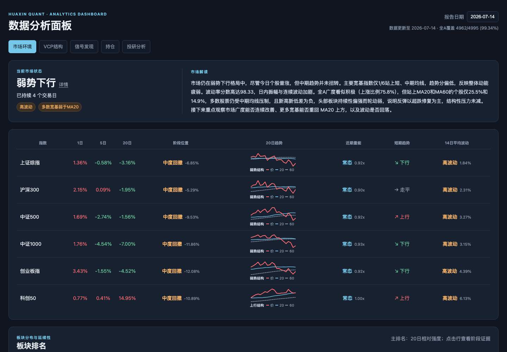
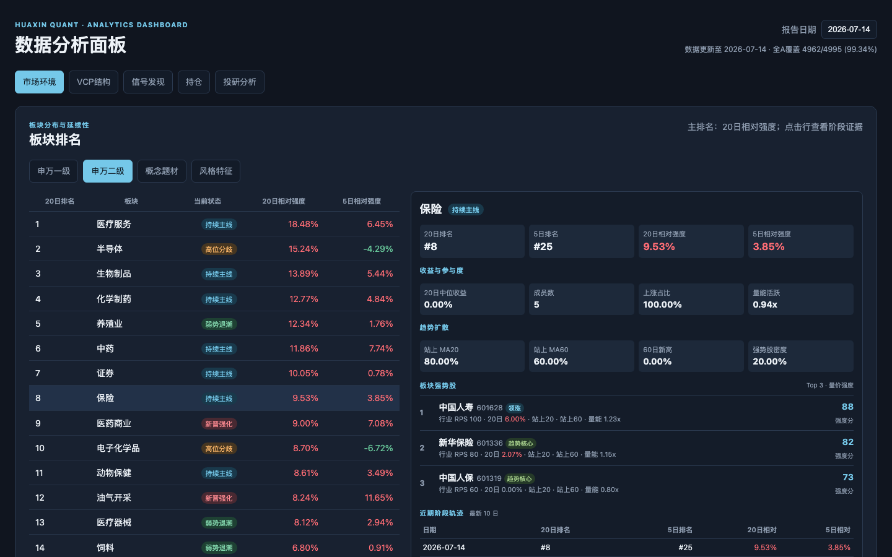
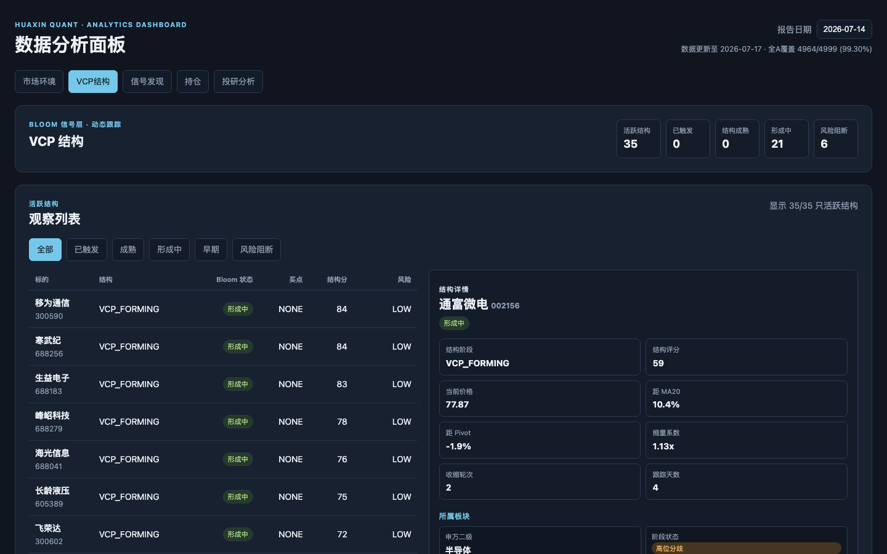

# Huaxin Quant

[English](README.en.md) | 中文

面向 A 股的研究型多模型发现与跟踪系统：用基本面筛选、VCP 量价结构、跨日信号和次日计划，把候选标的变成可复现的观察流程。核心判断由脚本和策略配置执行；LLM 仅用于市场与信号解读，不参与结构或买点判定。

> 仅供研究与复盘，不构成投资建议。

### 市场环境 · 2026-07-14



### 板块排名



### VCP 结构



## 一键运行

```bash
python3 -m pip install -r requirements.txt
cp .env.example .env
python3 scripts/init_runtime.py

# 默认按 15:00 分界线取预期最近交易日
python3 scripts/daily.py &

# 指定交易日回补完整流程
python3 scripts/daily.py --date 260709 &
python3 scripts/monitor.py --date 260709
```

`daily.py` 会按同一日期执行：数据补齐 → Pool → Quant → Bloom → Signal Plan → 市场环境 / VCP 结构 / 信号发现页面发布 → 完整性核验。任一页面数据缺失，流程会报错而不会静默完成。

## 模块

| 层 | 模块 | 作用 |
|---|---|---|
| 基础筛选 | Pool | 基本面初筛与候选池 |
| 量价结构 | Quant | VCP 阶段、风险事实与 PULLBACK / BREAKOUT / RETEST 买点 |
| 信号跟踪 | Bloom + Signal Plan | 跨日生命周期、重点观察与次日量价触发区间 |
| 市场环境 | Market Regime | 宽基趋势、全 A 广度、板块排名与强势股 |
| 辅助模块 | Valuation / Position | 深度估值与本地持仓账本 |

## 常用入口

```bash
python3 scripts/quant_filter.py --date 260709
python3 scripts/bloom.py --date 260709
python3 scripts/signal_plan.py --date 260709
python3 scripts/market_regime.py run --date 2026-07-09
```

运行后打开 `dashboard/index.html`，可按日期查看市场环境、VCP 结构和信号发现。

## 项目结构

```text
instructions/  模型规则与执行约束
strategies/    可调策略参数
scripts/       流水线、数据和计算脚本
dashboard/     只读数据分析面板
WORKFLOW.md    标准日流程与回补说明
```

运行产物（`cache/`、`pool/`、`quant/`、`bloom/`、`signal_plan/`、`market/` 等）默认保留在本地，不提交 Git。

详细规则见：[Pool](instructions/01-pool.md) · [Quant](instructions/02-quant.md) · [Bloom](instructions/signal-bloom.md) · [Signal Plan](instructions/signal-plan.md) · [Market Regime](instructions/market-regime.md) · [Workflow](WORKFLOW.md)。
