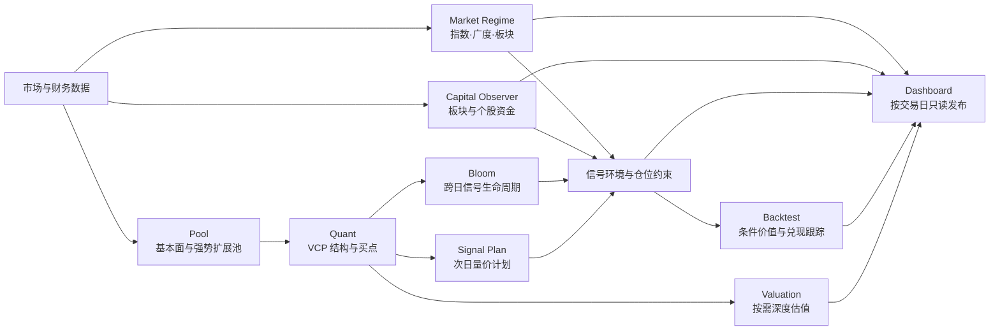

# Huaxin Quant

[English](README.en.md) | 中文

[](https://github.com/neilnee/huaxin-quant/tags)
[](https://www.python.org/)
[](LICENSE)

**面向 A 股研究与复盘的可审计量化工作流。** 通过基本面筛选、VCP 量价结构、跨日信号生命周期、市场与资金旁路验证，把候选发现转化为按交易日归档、可复现的观察流程。

核心结构、买点、评分和仓位约束由脚本与版本化策略执行；LLM 仅用于受约束的市场、信号和估值研究解读，不改写确定性结论。

> 本项目仅用于研究、工程实验与历史复盘，不构成投资建议。任何信号、计划、估值或仓位提示均不代表收益承诺。


## 为什么是 Huaxin Quant

| 原则 | 实现方式 |
|---|---|
| 确定性决策 | Pool、VCP、买点、风险、阶段和仓位规则由 Python 与策略 JSON 执行 |
| 跨日生命周期 | Bloom 持续记录结构形成、成熟、触发、冷却、失效与退出 |
| 环境独立验证 | 市场状态、申万板块、主力资金、融资资金与基本面分别展示，不相互冒充 |
| 可审计输出 | 输入、策略版本、真实数据日期、失败原因和同日页面包均可回溯 |
| 失败显式化 | 关键阶段失败、LLM 未达发布要求或日期产物不完整时，流水线不会静默标记完成 |

## 系统架构



各模块只处理自己职责内的事实或判断。市场状态不重写 VCP，资金不改变买点评分，LLM 不替代结构规则，估值也不自动变成交易动作。

## 当前能力

| 层级 | 模块 | 主要输出 |
|---|---|---|
| 数据 | Market Data / Capital Data | 交易日行情、证券母体、板块快照、主力与融资资金缓存 |
| 初筛 | Pool | 基本面质量池、全市场相对强势扩展池、软标签 |
| 结构 | Quant | VCP 阶段、收缩轮次、量能事实、风险标记及三类买点 |
| 信号 | Bloom | 跨日观察状态、结构升级、触发、冷却、失效与估值候选 |
| 计划 | Signal Plan | 下一交易日 PULLBACK / BREAKOUT / RETEST 量价条件与失效位 |
| 环境 | Market Regime | 宽基趋势、全 A 广度、板块生命周期、今日主线与强势股 |
| 资金 | Capital Observer | 行业成交额迁移、板块主力确认、个股主力和融资验证 |
| 评价 | Backtest | 买点兑现、5/10/20 日表现及市场、板块、资金条件区分度 |
| 研究 | Valuation | 带证据门禁、机构共识、三情景参数和计算结果的估值运行包 |
| 账本 | Position / Watchlist Sync | 本地持仓账本与可选的系统受管自选同步 |

## 功能展示

以下主流程截图来自交易日 `2026-08-12`。截图按模块裁切，保留判断上下文、状态标签与真实数据日期；个股名称、证券代码和公司专属研究内容均已脱敏。估值示例为独立的 `2026-07-25` 研究运行。

<table>
<tr>
<td width="50%" valign="top"><br><sub><b>板块环境</b>：比较行业与概念强度，并展开阶段趋势和代表标的。</sub></td>
<td width="50%" valign="top"><br><sub><b>资金观察</b>：把成交额迁移、主力确认和候选股资金事实分层展示。</sub></td>
</tr>
<tr>
<td width="50%" valign="top"><br><sub><b>VCP 结构</b>：展示收缩轮次、量能、关键位置、评分依据和候选来源。</sub></td>
<td width="50%" valign="top"><br><sub><b>信号详情</b>：把触发条件、仓位预案和主力/融资各自的数据日期放在同一证据链中。</sub></td>
</tr>
<tr>
<td width="50%" valign="top"><br><sub><b>历史兑现</b>：按买点、观察窗口和成立环境追踪 5/10/20 日表现。</sub></td>
<td width="50%" valign="top"><br><sub><b>按需估值</b>：从公司摘要进入机构共识、情景估值与后续验证节点。</sub></td>
</tr>
</table>

截图的选取、脱敏和维护规则见 [截图说明](docs/SCREENSHOT_PLAN.md)。

## 快速开始

### 1. 安装

```bash
git clone https://github.com/neilnee/huaxin-quant.git
cd huaxin-quant

python3 --version  # 需要 Python 3.11+
python3 -m venv .venv
source .venv/bin/activate
python3 -m pip install -r requirements.txt
```

### 2. 配置运行环境

```bash
cp .env.example .env
python3 scripts/init_runtime.py
```

初始化脚本会创建当前流水线所需的本地缓存、报告、市场、资金、回测、Dashboard 数据和 `position/` 账本目录；不会再创建已经退出正式架构的旧 `signals/` 持仓模板。

完整日流程需要按实际数据适配器配置 `.env`：

| 配置 | 用途 |
|---|---|
| `MX_APIKEY` | 东方财富妙想数据、资金和可选自选管理 |
| `HUAXIN_XUANGU_SCRIPT` | Pool 阶段的选股数据适配脚本 |
| `DEEPSEEK_API_KEY` | 每日市场解读、今日主线及其他受约束 LLM 输出 |
| `DEEPSEEK_BASE_URL` | OpenAI 兼容模型服务地址 |

密钥只从环境变量或本地 `.env` 读取。`.env`、运行缓存、持仓与报告产物默认不进入 Git。

### 3. 运行每日流水线

```bash
# 15:00 后默认运行最近预期交易日
python3 scripts/daily.py &

# 前台查看阶段进度
python3 scripts/monitor.py

# 指定交易日回补
python3 scripts/daily.py --date 260812 &
python3 scripts/monitor.py --date 260812
```

默认流程：

```text
市场数据更新 → Pool → Quant → Bloom → Signal Plan → 财务提示
→ 完整资金观测 → 市场 / 回测 / VCP / 信号页面发布
→ 日期与产物完整性核验 → 打开 Dashboard → 可选自选同步
```

执行完成后打开 `dashboard/index.html`，按日期查看市场环境、资金观测、VCP 结构、信号发现、回测和估值结果。

## 核心输出与审计边界

| 输出 | 说明 |
|---|---|
| `pool/pool_<YYMMDD>.csv` | 当日候选池与来源通道 |
| `cache/quant_runs/quant_<YYMMDD>.json` | 模型二结构化事实，是 Bloom 与 Plan 的权威输入 |
| `bloom/state/bloom_input_<YYMMDD>.json` | 当日 Bloom 输入及生命周期结果 |
| `signal_plan/signal_plan_<YYMMDD>.json` | 下一交易日条件计划 |
| `market/market_regime_<YYMMDD>.json` | 市场状态、板块阶段与 LLM 解读状态 |
| `capital/capital_observer_<YYMMDD>.json` | 完整资金观测及实际数据日期 |
| `backtest/backtest_<YYMMDD>.json` | 历史兑现和条件价值统计 |
| `cache/valuation_runs/<run_id>/` | 估值证据、研究卡、参数、结果与运行清单 |
| `dashboard/data/<YYYYMM>/*.js` | 同日只读页面数据包 |

历史运行结果会保存对应 `strategy_version`。资金数据分别保留主力和融资的实际日期；历史板块快照不足时明确标注非严格点时回填，不伪装成可回测数据。

## 常用命令

```bash
# 模型一：候选池
python3 scripts/run_pool.py

# 模型二：全量或单股 VCP
python3 scripts/quant_filter.py
python3 scripts/quant_filter.py --code 603444

# 市场环境
python3 scripts/market_regime.py update
python3 scripts/market_regime.py run

# 信号生命周期与次日计划
python3 scripts/bloom.py
python3 scripts/signal_plan.py

# 按需估值
python3 scripts/run_valuation.py --code 300442 --name 润泽科技

# 单元测试
python3 -m unittest discover -s scripts -p 'test_*.py'
```

也可以运行统一的离线工程检查（语法、单测、策略 JSON、Dashboard JavaScript 和 Git 空白检查）：

```bash
python3 scripts/check.py
```

## 项目结构

```text
instructions/  模型规则、字段口径与执行约束
strategies/    版本化阈值、权重和状态配置
scripts/       数据层、模型、流水线、发布器与测试
dashboard/     本地只读数据分析面板
docs/          架构说明与公开图片资源
DESIGN.md      模型边界与分层设计
WORKFLOW.md    标准日流程、回补与异常处理
TODO.md        已完成能力与后续路线
```

运行产物包括 `cache/`、`pool/`、`quant/`、`bloom/`、`signal_plan/`、`market/`、`capital/`、`backtest/`、`reports/` 和 `position/`，默认只保存在本地。

## 文档导航

- 总体设计：[DESIGN.md](DESIGN.md)
- 日常运行：[WORKFLOW.md](WORKFLOW.md)
- Pool：[instructions/01-pool.md](instructions/01-pool.md)
- Quant / VCP：[instructions/02-quant.md](instructions/02-quant.md)
- Market Regime：[instructions/market-regime.md](instructions/market-regime.md)
- Capital Observer：[instructions/capital-observer.md](instructions/capital-observer.md)
- Bloom：[instructions/signal-bloom.md](instructions/signal-bloom.md)
- Signal Plan：[instructions/signal-plan.md](instructions/signal-plan.md)
- Backtest：[instructions/backtest.md](instructions/backtest.md)
- Valuation：[instructions/03-valuation.md](instructions/03-valuation.md)
- 路线图：[TODO.md](TODO.md)

## 数据、模型与风险说明

- 项目依赖外部行情及金融数据适配器；接口权限、覆盖范围和更新时间可能影响结果。
- 两融数据通常比当日主力订单流滞后，页面会分别展示实际数据日期。
- LLM 输出必须受结构化事实约束，但仍可能失败或产生不完整文本；确定性模型结果不以 LLM 成功为前提，市场每日正式发布除外。
- 严格点时回测只使用已保存的当日快照；当前成分回填仅用于环境观察。
- 请勿提交 API Key、账户信息、持仓账本、运行缓存或未脱敏报告。

## License

[MIT](LICENSE) © 2026 Huaxin Quant contributors
